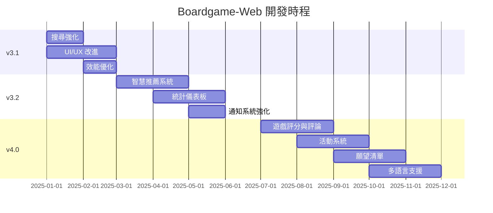

# 🗺️ Boardgame-Web 開發路線圖

> 最後更新：2025-12-16

## 📊 專案現況

**當前版本：** v3.0 (Gallery Wall & BGG Ranks Integration)

### ✅ 已完成功能

| 模組 | 功能 | 狀態 |
|------|------|------|
| **桌遊管理** | 借還操作、狀態追蹤、歷史記錄 | ✅ 完成 |
| **BGG 整合** | 遊戲連結、搜尋、熱門排行、推薦 | ✅ 完成 |
| **BGG Ranks** | 離線資料庫、30萬+遊戲查詢 | ✅ 完成 |
| **Gallery Wall** | 視覺化展示、多條件過濾 | ✅ 完成 |
| **管理後台** | 批次操作、權限控管 | ✅ 完成 |
| **會員管理** | 搜尋、借閱記錄 | ✅ 完成 |
| **成就系統** | 成就追蹤、視覺化呈現 | ✅ 完成 |
| **Email 通知** | 關鍵更新通知 | ✅ 完成 |
| **BGG 加入** | 從 BGG 搜尋並加入遊戲到館藏 | ✅ 完成 |

---

## 🎯 v3.1 - 使用者體驗優化 (短期目標)

**預計完成：** 2025 Q1

### 🔧 改進項目

- [ ] **搜尋強化**
  - 全站搜尋功能（遊戲 + 會員）
  - 搜尋歷史與建議
  - 拼音/注音模糊搜尋

- [ ] **UI/UX 改進**
  - 深色模式支援
  - 行動裝置手勢操作
  - 載入動畫與骨架屏
  - 更豐富的遊戲卡片資訊

- [ ] **效能優化**
  - 圖片懶加載
  - API 回應快取優化
  - 前端資源壓縮

---

## 🚀 v3.2 - 智慧功能 (中期目標)

**預計完成：** 2025 Q2

### 🤖 新功能

- [ ] **智慧推薦系統**
  - 基於借閱歷史的個人化推薦
  - 「類似遊戲」推薦
  - 季節性/節日推薦

- [ ] **統計儀表板**
  - 借閱趨勢圖表
  - 熱門遊戲排行
  - 會員活躍度分析
  - 庫存狀態總覽

- [ ] **通知系統強化**
  - LINE / Discord 機器人通知
  - 借閱逾期自動提醒
  - 新遊戲到館通知

---

## 🌟 v4.0 - 社群與互動 (長期目標)

**預計完成：** 2025 Q3-Q4

### 🎮 大型功能

- [ ] **遊戲評分與評論**
  - 會員評分功能
  - 遊戲評論/心得
  - 評分排行榜

- [ ] **活動系統**
  - 桌遊聚會活動管理
  - 活動報名與簽到
  - 活動照片記錄

- [ ] **願望清單**
  - 會員想玩清單
  - 社團採購建議
  - BGG 願望清單同步

- [ ] **多語言支援**
  - 英文介面
  - 遊戲名稱多語言顯示

---

## 🔒 技術債與維護

### 持續性任務

- [ ] 提升測試覆蓋率至 80%
- [ ] API 文件自動生成 (OpenAPI/Swagger)
- [ ] 日誌系統完善
- [ ] 容器化部署優化 (Docker Compose)
- [ ] CI/CD 流程完善 (GitHub Actions)

### 程式碼品質

- [x] 移除 `boardgame_system.py` 舊架構 *(已重構為 `core/facade.py`)*
- [x] 統一錯誤處理機制 *(已完成)*
- [ ] Pydantic 模型全面導入
- [ ] 類型檢查 (mypy) 通過率 100%

---

## 📅 里程碑時間表

---

## 🙋 如何貢獻

1. 從上方選擇一個感興趣的功能
2. 在 GitHub Issues 中認領任務
3. 建立功能分支開發
4. 提交 Pull Request

---

## 📝 變更記錄

| 版本 | 日期 | 主要變更 |
|------|------|----------|
| v3.0 | 2025-12-04 | Gallery Wall、BGG Ranks 整合 |
| v2.0 | 2025-11 | BGG 整合、成就系統 |
| v1.0 | 2025-10 | 基礎借還功能 |
