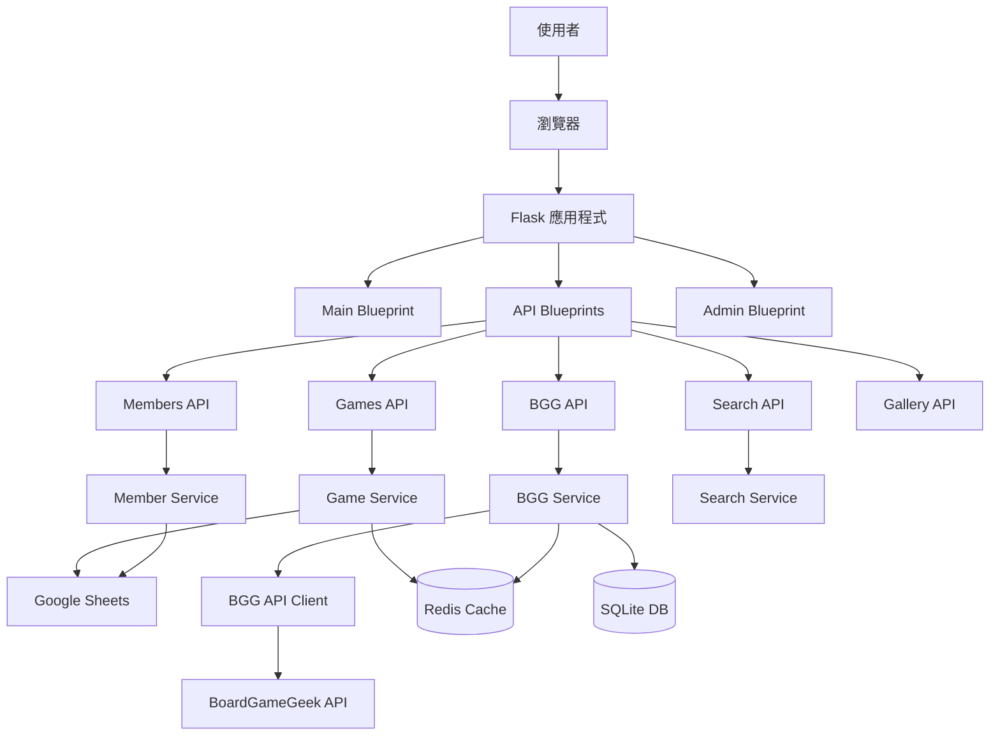
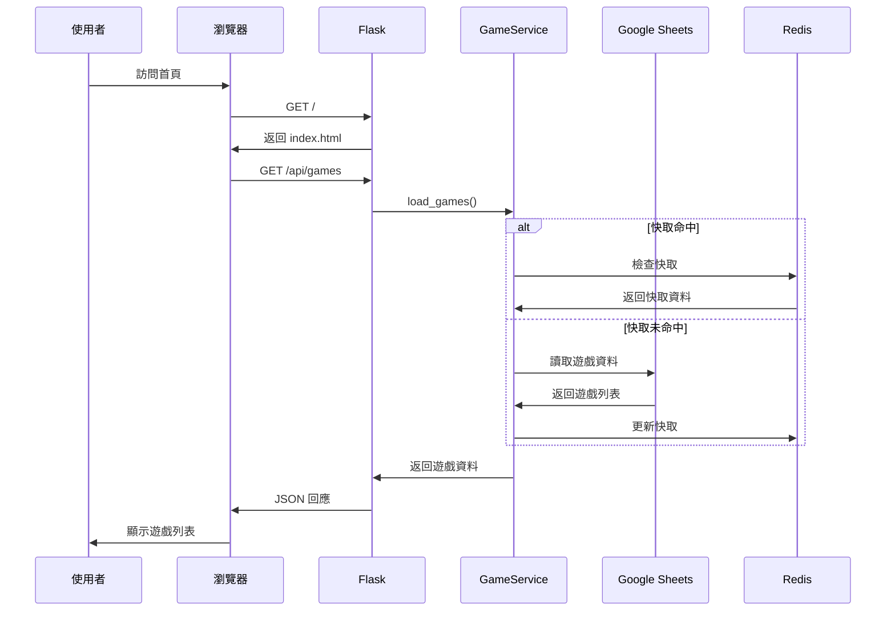
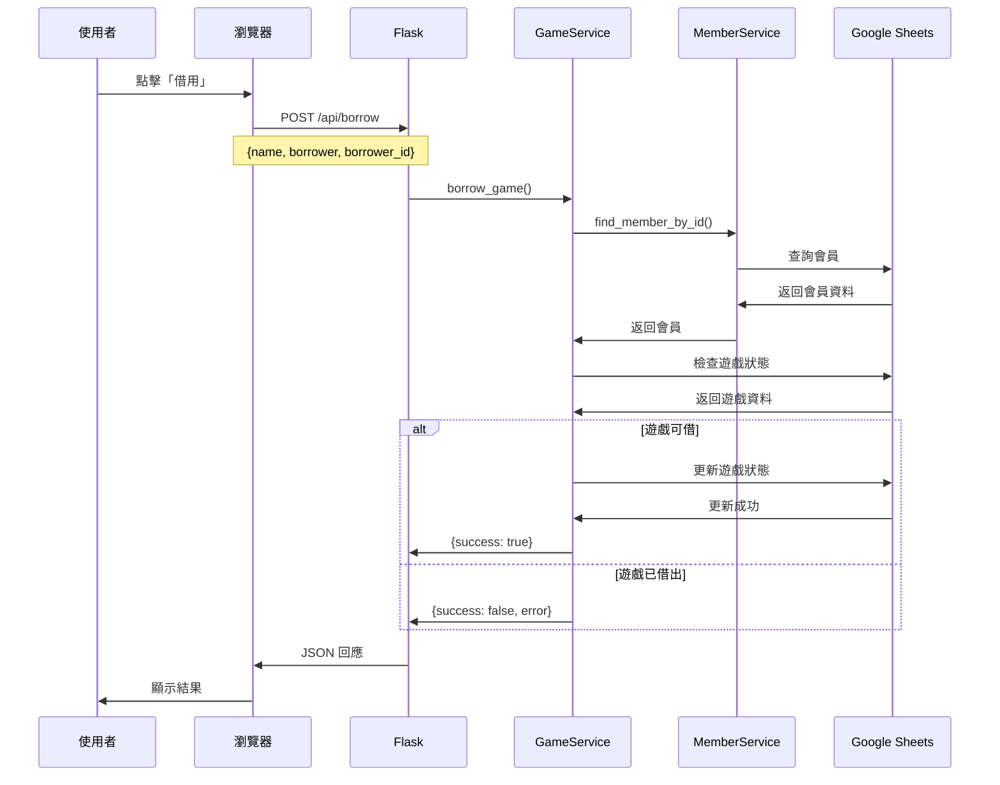
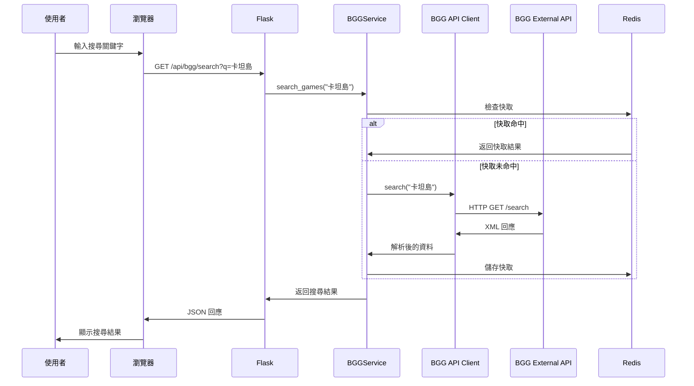
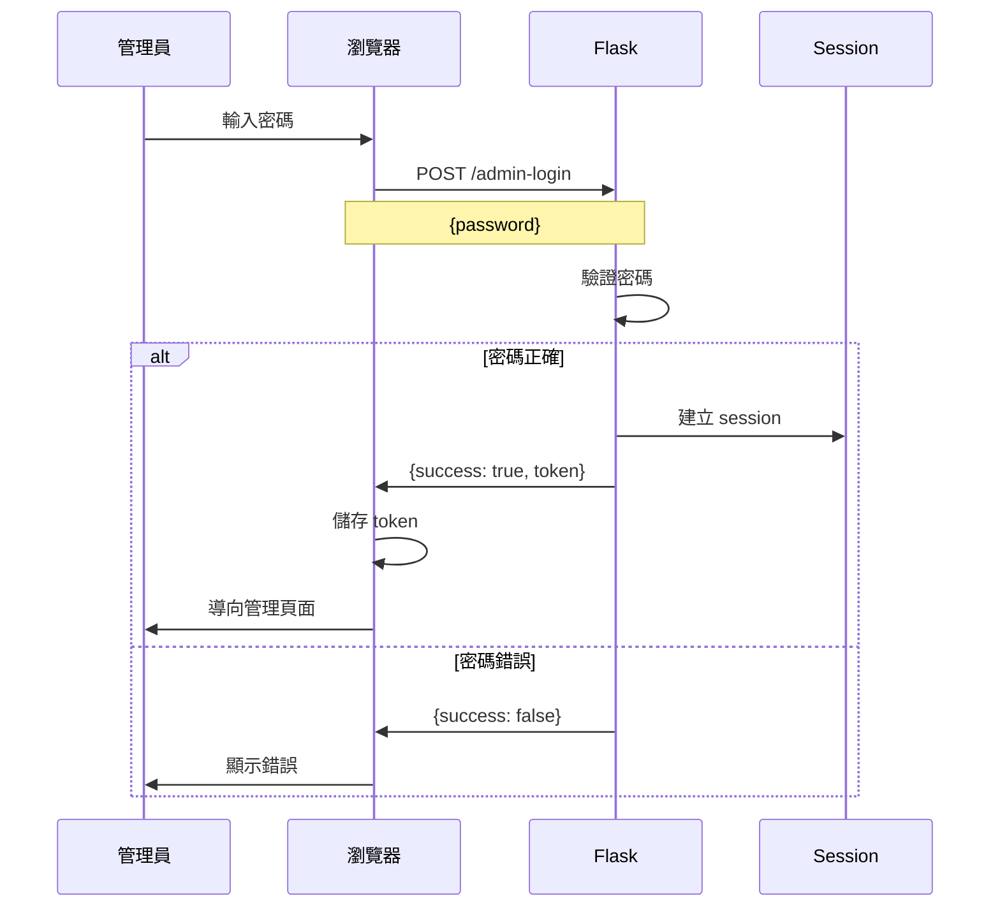

# 📊 Boardgame-Web 資料流程文檔

**專案**: Boardgame-Web  
**最後更新**: 2025-12-21

---

## 🎯 概覽

本文檔描述 Boardgame-Web 系統中的資料流程，包含使用者操作、資料流向和系統互動。

---

## 🏗️ 系統架構圖



---

## 📱 使用者操作流程

### 1. 瀏覽遊戲列表



### 2. 借用遊戲



### 3. BGG 遊戲搜尋



---

## 🔄 資料流向

### 遊戲資料流

```
Google Sheets (來源)
    ↓
SheetsClient (讀取)
    ↓
Redis Cache (快取)
    ↓
GameService (處理)
    ↓
API Endpoint (暴露)
    ↓
前端 JavaScript (渲染)
    ↓
使用者介面 (顯示)
```

### BGG 資料流

```
BoardGameGeek API (外部)
    ↓
BGG API Client (請求)
    ↓
BGGService (處理)
    ↓
Redis Cache (快取)
    ↓
API Endpoint (暴露)
    ↓
前端 JavaScript (渲染)
    ↓
使用者介面 (顯示)
```

### 排名資料流

```
SQLite Database (本地)
    ↓
BGGRanksService (查詢)
    ↓
索引優化 (加速)
    ↓
API Endpoint (暴露)
    ↓
前端 JavaScript (渲染)
    ↓
使用者介面 (顯示)
```

---

## 🎨 前端資料流

### 頁面載入流程

```
1. 使用者訪問 → index.html 載入
2. CSS 載入 → 樣式渲染
3. JavaScript 載入 → 初始化
4. API 請求 → /api/games
5. 資料接收 → JSON 解析
6. 分頁處理 → 每頁 50 筆
7. DOM 渲染 → 顯示第 1 頁
8. 圖片懶載入 → 可見區域圖片
```

### 搜尋流程

```
1. 使用者輸入 → 防抖處理 (300ms)
2. 篩選條件 → 狀態、保管人等
3. 本地篩選 → JavaScript 過濾
4. 分頁重置 → 回到第 1 頁
5. DOM 更新 → 顯示結果
```

---

## 💾 快取策略

### Redis 快取

**快取鍵格式**:
- 遊戲列表: `games:all`
- BGG 搜尋: `bgg:search:{query}`
- BGG 詳情: `bgg:game:{game_id}`
- 推薦遊戲: `bgg:recommendations:{category}`

**TTL 設定**:
- 遊戲列表: 300 秒 (5 分鐘)
- BGG 搜尋: 300 秒 (5 分鐘)
- BGG 詳情: 3600 秒 (1 小時)
- 推薦遊戲: 1800 秒 (30 分鐘)

### HTTP 快取

**靜態資源**:
- Cache-Control: max-age=31536000 (1 年)
- ETag: MD5 hash

**API 端點**:
- /api/games: max-age=300 (5 分鐘)
- /api/bgg/*: max-age=3600 (1 小時)
- /api/members: max-age=300 (5 分鐘)

---

## 🔐 認證流程

### 管理員登入



---

## 📊 批次操作流程

### 批次借用

```
1. 選擇多個遊戲 → 遊戲名稱列表
2. 輸入借用人 → 會員 ID
3. 驗證會員 → MemberService
4. 檢查遊戲狀態 → 逐一驗證
5. 建立批次更新 → batch_update
6. 執行更新 → Google Sheets API
7. 清除快取 → Redis
8. 返回結果 → 成功/失敗列表
```

---

## 🎯 效能優化流程

### 並發請求

```
傳統流程:
遊戲 1 → 請求 → 回應 (3s)
遊戲 2 → 請求 → 回應 (3s)
遊戲 3 → 請求 → 回應 (3s)
總時間: 9 秒

並發流程:
遊戲 1 ┐
遊戲 2 ├→ ThreadPoolExecutor → 並發請求 → 回應
遊戲 3 ┘
總時間: 3 秒
```

### 分頁渲染

```
優化前:
414 筆遊戲 → 全部渲染 → 4,140 DOM 節點 → 800ms

優化後:
414 筆遊戲 → 分頁 (50/頁) → 1,018 DOM 節點 → 100ms
```

---

## 🔍 錯誤處理流程

```
1. 錯誤發生 → Exception
2. 記錄日誌 → Logger
3. 錯誤處理器 → Error Handler
4. 格式化回應 → JSON
5. HTTP 狀態碼 → 4xx/5xx
6. 返回前端 → 顯示錯誤訊息
```

---

**文檔建立者**: AI Agent  
**建立時間**: 2025-12-21 19:03  
**版本**: 1.0
