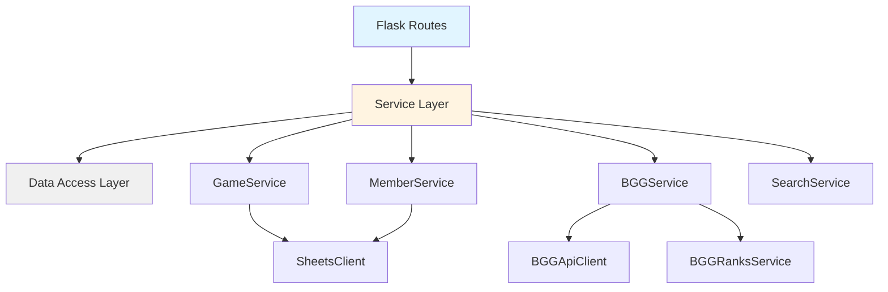
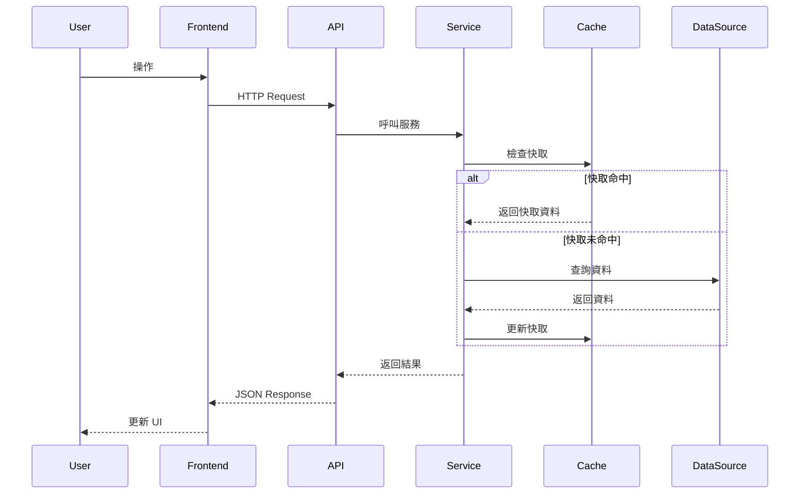

# Boardgame-Web 程式碼庫文檔

> 完整的程式碼庫文檔，涵蓋架構設計、核心模組、API 參考和最佳實踐。

**最後更新**: 2025-12-21  
**文檔版本**: 1.0

---

## 📚 文檔導航

### 🏗️ 架構文檔
- [資料流程](architecture/data_flow.md) - 系統資料流程和整合機制
- [系統設計](architecture/system_design.md) - 整體架構和設計決策

### 📦 模組文檔
- [核心模組](modules/core_modules.md) - 核心業務邏輯和服務層（19 個模組）
- [應用程式結構](modules/app_structure.md) - Flask 應用程式、配置和路由（23 個檔案）
- [前端資源](modules/frontend_resources.md) - JavaScript、CSS 和 HTML 模板
- [測試指南](modules/testing_guide.md) - 測試架構和執行指南

### 🔌 API 文檔
- [API 參考](api/api_reference.md) - 完整的 API 端點文檔

---

## 🎯 快速開始

### 專案架構總覽

```
boardgame-web/
├── app/                    # Flask 應用程式
│   ├── blueprints/        # 路由 Blueprints
│   ├── config/            # 配置管理
│   └── middleware/        # 中介軟體
├── core/                   # 核心業務邏輯
│   ├── *_service.py       # 服務層
│   ├── *_client.py        # 客戶端
│   └── cache.py           # 快取機制
├── static/                 # 前端資源
│   ├── js/                # JavaScript
│   ├── css/               # 樣式表
│   └── html/              # HTML 模板
├── tests/                  # 測試
│   ├── unit/              # 單元測試
│   └── integration/       # 整合測試
├── scripts/                # 維護腳本
└── docs/                   # 文檔
```

---

## 🔍 核心概念

### 服務層架構

Boardgame-Web 採用**服務導向架構**（Service-Oriented Architecture），將業務邏輯封裝在獨立的服務類別中：



**優點**:
- 清晰的職責分離
- 易於測試和維護
- 可重用的業務邏輯

### 資料流程



---

## 📦 核心模組速查

### 資料存取層

| 模組 | 職責 | 關鍵類別 |
|------|------|----------|
| [sheets_client.py](modules/core_modules.md#sheetsclien tpy) | Google Sheets 整合 | `SheetsClient` |
| [bgg_api_client.py](modules/core_modules.md#bggapiclientpy) | BGG API 客戶端 | `BGGApiClient` |
| [bgg_ranks_service.py](modules/core_modules.md#bggranksservicepy) | BGG 排名資料庫 | `BGGRanksService` |

### 業務邏輯層

| 模組 | 職責 | 關鍵類別 |
|------|------|----------|
| [game_service.py](modules/core_modules.md#gameservicepy) | 遊戲業務邏輯 | `GameService` |
| [member_service.py](modules/core_modules.md#memberservicepy) | 會員業務邏輯 | `MemberService` |
| [bgg_service.py](modules/core_modules.md#bggservicepy) | BGG 服務層 | `BGGService` |
| [search_service.py](modules/core_modules.md#searchservicepy) | 搜尋功能 | `SearchService` |
| [expansion_service.py](modules/core_modules.md#expansionservicepy) | 擴充管理 | `ExpansionService` |

### 工具與支援

| 模組 | 職責 | 關鍵功能 |
|------|------|----------|
| [cache.py](modules/core_modules.md#cachepy) | 快取機制 | `SimpleCache`, `@cache_with_timeout` |
| [email_notifier.py](modules/core_modules.md#emailnotifierpy) | 郵件通知 | `EmailNotifier` |
| [utils.py](modules/core_modules.md#utilspy) | 工具函數 | 時間戳、正規化等 |
| [exceptions.py](modules/core_modules.md#exceptionspy) | 自定義例外 | 各類業務例外 |

---

## 🛣️ API 端點速查

### 遊戲 API

| 端點 | 方法 | 描述 |
|------|------|------|
| `/api/games` | GET | 取得所有遊戲 |
| `/api/games/<name>` | GET | 取得單一遊戲 |
| `/api/games` | POST | 新增遊戲 |
| `/api/games/<name>/borrow` | POST | 借出遊戲 |
| `/api/games/<name>/return` | POST | 歸還遊戲 |
| `/api/games/<name>/link-bgg` | POST | 連結 BGG |

### BGG API

| 端點 | 方法 | 描述 |
|------|------|------|
| `/api/bgg/search` | GET | 搜尋 BGG 遊戲 |
| `/api/bgg/game/<id>` | GET | 取得 BGG 遊戲詳情 |
| `/api/bgg/hot` | GET | 熱門遊戲 |
| `/api/bgg/recommendations/party` | GET | 派對遊戲推薦 |
| `/api/bgg/recommendations/strategy` | GET | 策略遊戲推薦 |

### 其他 API

| 端點 | 方法 | 描述 |
|------|------|------|
| `/api/members` | GET | 取得所有會員 |
| `/api/search` | GET | 搜尋遊戲 |
| `/api/gallery/games` | GET | 圖庫遊戲 |

完整 API 文檔請參閱 [API 參考](api/api_reference.md)。

---

## 🧪 測試

### 執行測試

```bash
# 執行所有測試
pytest

# 執行單元測試
pytest tests/unit/ -v

# 執行整合測試
pytest tests/integration/ -v

# 查看覆蓋率報告
pytest --cov=core --cov=app --cov-report=html
```

### 測試組織

```
tests/
├── conftest.py           # pytest 配置和 fixtures
├── unit/                 # 單元測試（23 個檔案）
│   ├── test_*_service.py
│   └── test_*_client.py
└── integration/          # 整合測試（10 個檔案）
    ├── test_*_api.py
    └── test_*_routes.py
```

詳細測試指南請參閱 [測試指南](modules/testing_guide.md)。

---

## 🔧 開發指南

### 環境設置

1. **安裝依賴**
   ```bash
   pip install -r requirements.txt
   pip install -r requirements-dev.txt
   ```

2. **配置環境變數**
   ```bash
   cp .env.example .env
   # 編輯 .env 填入必要的配置
   ```

3. **啟動開發伺服器**
   ```bash
   python serve.py
   ```

### 新增功能

1. **建立服務類別** (在 `core/`)
   ```python
   class NewService:
       def __init__(self, dependency):
           self.dependency = dependency
       
       def do_something(self):
           # 業務邏輯
           pass
   ```

2. **建立 API 端點** (在 `app/blueprints/api/`)
   ```python
   @api_bp.route('/new-endpoint')
   def new_endpoint():
       service = NewService()
       result = service.do_something()
       return jsonify(result)
   ```

3. **撰寫測試**
   ```python
   def test_new_service():
       service = NewService(mock_dependency)
       result = service.do_something()
       assert result == expected
   ```

---

## 📝 編碼規範

### Python 風格

- 使用 **Type Hints**
- 使用 **Google 風格的 Docstrings**
- 遵循 **PEP 8** 規範
- 使用 **Pydantic** 進行資料驗證

### 服務層設計

- 每個服務專注於單一職責
- 使用依賴注入
- 避免服務之間的循環依賴
- 所有外部 API 呼叫必須通過服務層

### 錯誤處理

- 使用自定義例外類別
- 在 API 層統一處理錯誤
- 記錄所有錯誤到日誌

詳細編碼規範請參閱 [.context/coding_style.md](../.context/coding_style.md)。

---

## 🔍 常見任務

### 如何新增一個遊戲？

1. 透過 API:
   ```bash
   curl -X POST http://localhost:5000/api/games \
     -H "Content-Type: application/json" \
     -d '{"name": "新遊戲", "players": "2-4"}'
   ```

2. 透過前端: 訪問管理頁面 `/admin`

### 如何連結遊戲到 BGG？

1. 搜尋 BGG ID:
   ```bash
   curl http://localhost:5000/api/bgg/search?q=卡坦島
   ```

2. 連結遊戲:
   ```bash
   curl -X POST http://localhost:5000/api/games/卡坦島/link-bgg \
     -H "Content-Type: application/json" \
     -d '{"bgg_id": 13}'
   ```

### 如何更新 BGG 排名資料？

```bash
python scripts/update/import_bgg_ranks.py
```

### 如何刷新快取？

```bash
curl -X POST http://localhost:5000/admin/refresh-cache
```

---

## 🚀 部署

### 生產環境配置

1. 設置環境變數:
   ```bash
   export FLASK_ENV=production
   export SECRET_KEY=your-secret-key
   export GOOGLE_SHEET_ID=your-sheet-id
   ```

2. 使用 Gunicorn:
   ```bash
   gunicorn -w 4 -b 0.0.0.0:8000 serve:app
   ```

3. 使用 Docker:
   ```bash
   docker-compose up -d
   ```

---

## 📊 效能優化

### 快取策略

- **遊戲資料**: 5 分鐘 TTL
- **BGG 遊戲詳情**: 24 小時 TTL
- **BGG 推薦列表**: 1 小時 TTL

### 未來改進

- [ ] 引入 Redis 分散式快取
- [ ] 實作 BGG API 並發請求
- [ ] 優化 Google Sheets 批次操作
- [ ] 前端資源壓縮和合併

詳細效能優化計畫請參閱 [PERFORMANCE_OPTIMIZATION_PLAN.md](../PERFORMANCE_OPTIMIZATION_PLAN.md)。

---

## 🤝 貢獻指南

### 提交程式碼

1. Fork 專案
2. 建立功能分支: `git checkout -b feature/new-feature`
3. 撰寫測試並確保通過
4. 提交變更: `git commit -m "Add new feature"`
5. 推送分支: `git push origin feature/new-feature`
6. 建立 Pull Request

### 程式碼審查

- 確保所有測試通過
- 測試覆蓋率 > 80%
- 遵循編碼規範
- 更新相關文檔

---

## 📞 支援

### 問題回報

請在 GitHub Issues 中回報問題，並提供：
- 問題描述
- 重現步驟
- 預期行為
- 實際行為
- 環境資訊

### 聯絡方式

- GitHub: [boardgame-web](https://github.com/your-org/boardgame-web)
- Email: support@example.com

---

## 📄 授權

本專案採用 MIT 授權條款。

---

## 🙏 致謝

感謝所有貢獻者和以下開源專案：

- [Flask](https://flask.palletsprojects.com/)
- [gspread](https://github.com/burnash/gspread)
- [BoardGameGeek](https://boardgamegeek.com/)
- [Pydantic](https://pydantic-docs.helpmanual.io/)

---

**文檔維護**: Boardgame-Web Team  
**最後更新**: 2025-12-21  
**版本**: 1.0
