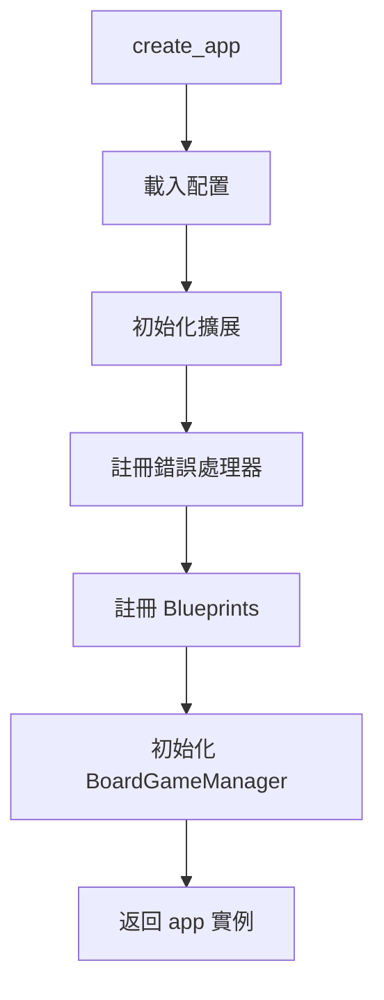
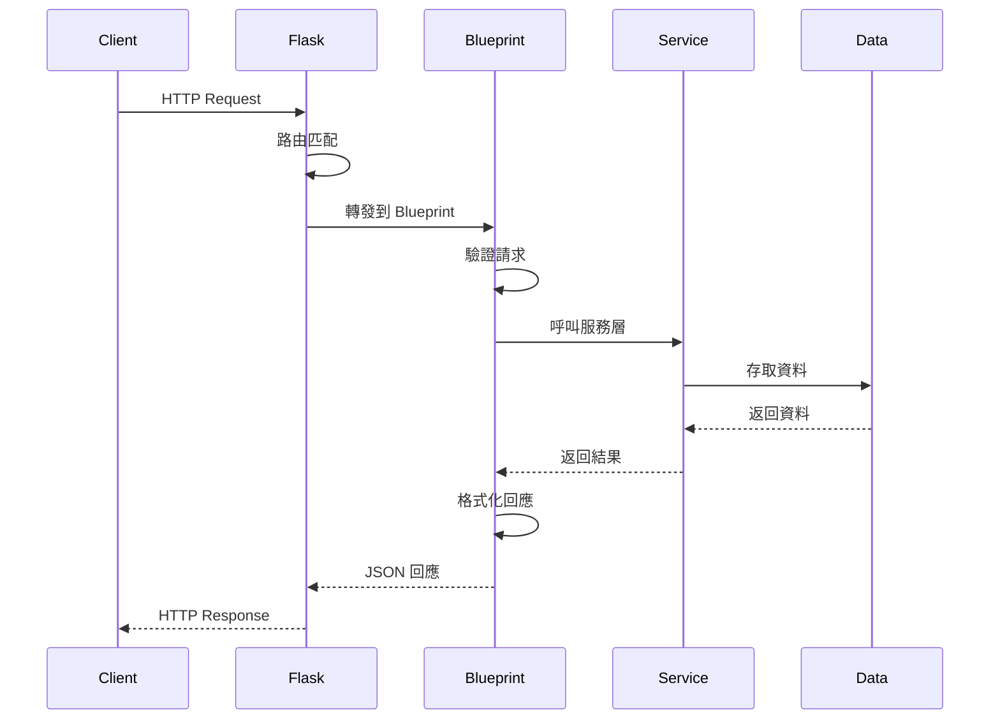

# 應用程式結構文檔 (App Structure)

本文檔詳細說明 `app/` 目錄下的 Flask 應用程式結構、配置管理、Blueprint 路由和中介軟體。

---

## 📊 應用程式架構總覽

```
app/
├── __init__.py              # 應用程式工廠
├── config/                  # 配置模組
│   ├── __init__.py
│   ├── base.py             # 基礎配置
│   ├── development.py      # 開發環境配置
│   ├── testing.py          # 測試環境配置
│   └── production.py       # 生產環境配置
├── blueprints/             # Flask Blueprints
│   ├── main/               # 主要路由
│   ├── admin/              # 管理路由
│   └── api/                # API 端點
├── middleware/             # 中介軟體
│   └── error_handlers.py  # 錯誤處理器
├── extensions.py           # Flask 擴展
├── schemas.py              # Pydantic 模型
└── utils.py                # 應用程式工具
```

---

## 🏭 應用程式工廠

### 📄 app/__init__.py

**路徑**: `app/__init__.py`  
**行數**: 60  
**主要職責**: 應用程式工廠函數，建立和配置 Flask 應用程式

#### 核心函數

**`create_app(config_name=None)`**

應用程式工廠函數，使用工廠模式建立 Flask 應用程式實例。

**參數**:
- `config_name` (str, optional): 配置名稱 ('development', 'testing', 'production')
  - 如果為 None，從環境變數 `FLASK_ENV` 讀取
  - 預設為 'development'

**返回**:
- `Flask`: 配置好的 Flask 應用程式實例

**初始化流程**:



**程式碼範例**:
```python
from app import create_app

# 建立開發環境應用程式
app = create_app('development')

# 或使用環境變數
# export FLASK_ENV=production
app = create_app()
```

**關鍵配置**:
- `static_folder='../static'` - 靜態檔案目錄
- `static_url_path=''` - 靜態檔案 URL 路徑
- 全域共享 `BoardGameManager` 實例

---

## ⚙️ 配置管理

### 📄 app/config/base.py

**路徑**: `app/config/base.py`  
**主要職責**: 基礎配置類別，定義所有環境共用的配置

#### 核心類別

**`Config`**

基礎配置類別。

**主要配置項**:
```python
class Config:
    # Flask 核心配置
    SECRET_KEY = os.getenv('SECRET_KEY', 'dev-secret-key')
    
    # Google Sheets 配置
    GOOGLE_SHEET_ID = os.getenv('GOOGLE_SHEET_ID')
    GOOGLE_SHEETS_CREDENTIALS = os.getenv('GOOGLE_SHEETS_CREDENTIALS')
    
    # BGG API 配置
    BGG_API_BASE_URL = 'https://boardgamegeek.com/xmlapi2'
    BGG_API_TIMEOUT = 30
    
    # 快取配置
    CACHE_TYPE = 'simple'
    CACHE_DEFAULT_TIMEOUT = 300
    
    # Demo 模式
    DEMO_MODE = os.getenv('DEMO_MODE', 'False').lower() == 'true'
    
    # 日誌配置
    LOG_LEVEL = os.getenv('LOG_LEVEL', 'INFO')
```

---

### 📄 app/config/development.py

**路徑**: `app/config/development.py`  
**主要職責**: 開發環境配置

#### 核心類別

**`DevelopmentConfig`**

開發環境配置，繼承自 `Config`。

**特殊配置**:
```python
class DevelopmentConfig(Config):
    DEBUG = True
    TESTING = False
    LOG_LEVEL = 'DEBUG'
    
    # 開發環境可能使用 Demo 模式
    DEMO_MODE = True
```

---

### 📄 app/config/testing.py

**路徑**: `app/config/testing.py`  
**主要職責**: 測試環境配置

#### 核心類別

**`TestingConfig`**

測試環境配置。

**特殊配置**:
```python
class TestingConfig(Config):
    TESTING = True
    DEBUG = True
    
    # 測試時使用 Demo 模式
    DEMO_MODE = True
    
    # 禁用 CSRF 保護
    WTF_CSRF_ENABLED = False
```

---

### 📄 app/config/production.py

**路徑**: `app/config/production.py`  
**主要職責**: 生產環境配置

#### 核心類別

**`ProductionConfig`**

生產環境配置。

**特殊配置**:
```python
class ProductionConfig(Config):
    DEBUG = False
    TESTING = False
    
    # 生產環境必須設置 SECRET_KEY
    SECRET_KEY = os.getenv('SECRET_KEY')
    if not SECRET_KEY:
        raise ValueError("生產環境必須設置 SECRET_KEY")
    
    # 禁用 Demo 模式
    DEMO_MODE = False
    
    # 日誌等級
    LOG_LEVEL = 'WARNING'
```

---

## 🔌 擴展初始化

### 📄 app/extensions.py

**路徑**: `app/extensions.py`  
**主要職責**: 初始化 Flask 擴展

#### 核心函數

**`init_extensions(app)`**

初始化所有 Flask 擴展。

**擴展列表**:
- **CORS**: 跨域資源共享
  ```python
  CORS(app, resources={r"/api/*": {"origins": "*"}})
  ```

**未來擴展**:
- Flask-Caching
- Flask-Limiter (API 速率限制)
- Flask-Compress (回應壓縮)

---

## 🛣️ Blueprint 路由

### 主要路由 (main/)

#### 📄 app/blueprints/main/routes.py

**路徑**: `app/blueprints/main/routes.py`  
**主要職責**: 主要頁面路由

**路由列表**:

| 路由 | 方法 | 描述 |
|------|------|------|
| `/` | GET | 首頁（遊戲列表） |
| `/admin` | GET | 管理頁面 |
| `/gallery` | GET | 圖庫頁面 |
| `/bgg-recommendations` | GET | BGG 推薦頁面 |

**程式碼範例**:
```python
@main_bp.route('/')
def index():
    """首頁 - 遊戲列表"""
    return send_from_directory('static/html', 'index.html')

@main_bp.route('/admin')
def admin():
    """管理頁面"""
    return send_from_directory('static/html', 'admin.html')
```

---

### 管理路由 (admin/)

#### 📄 app/blueprints/admin/routes.py

**路徑**: `app/blueprints/admin/routes.py`  
**主要職責**: 管理功能路由

**路由列表**:

| 路由 | 方法 | 描述 |
|------|------|------|
| `/admin/batch-borrow` | POST | 批次借出 |
| `/admin/batch-return` | POST | 批次歸還 |
| `/admin/refresh-cache` | POST | 刷新快取 |

---

### API 路由 (api/)

#### 📄 app/blueprints/api/games.py

**路徑**: `app/blueprints/api/games.py`  
**主要職責**: 遊戲相關 API

**路由列表**:

| 路由 | 方法 | 描述 | 參數 |
|------|------|------|------|
| `/api/games` | GET | 取得所有遊戲 | `status` (optional) |
| `/api/games/<name>` | GET | 取得單一遊戲 | - |
| `/api/games` | POST | 新增遊戲 | JSON body |
| `/api/games/<name>/borrow` | POST | 借出遊戲 | `borrower_id`, `borrower_name` |
| `/api/games/<name>/return` | POST | 歸還遊戲 | - |
| `/api/games/<name>/link-bgg` | POST | 連結 BGG | `bgg_id` |

**請求/回應範例**:

**GET /api/games**
```json
{
  "games": [
    {
      "name": "卡坦島",
      "status": "可用",
      "players": "3-4",
      "bgg_id": 13,
      "thumbnail": "https://..."
    }
  ],
  "total": 100
}
```

**POST /api/games/卡坦島/borrow**

請求:
```json
{
  "borrower_id": "E001",
  "borrower_name": "張三"
}
```

回應:
```json
{
  "success": true,
  "message": "借出成功",
  "game": {
    "name": "卡坦島",
    "status": "已借出",
    "borrower": "張三",
    "borrowed_at": "2025-12-21T15:30:00"
  }
}
```

---

#### 📄 app/blueprints/api/members.py

**路徑**: `app/blueprints/api/members.py`  
**主要職責**: 會員相關 API

**路由列表**:

| 路由 | 方法 | 描述 |
|------|------|------|
| `/api/members` | GET | 取得所有會員 |
| `/api/members/<id>` | GET | 取得單一會員 |

---

#### 📄 app/blueprints/api/bgg.py

**路徑**: `app/blueprints/api/bgg.py`  
**主要職責**: BGG 整合 API

**路由列表**:

| 路由 | 方法 | 描述 | 參數 |
|------|------|------|------|
| `/api/bgg/search` | GET | 搜尋 BGG 遊戲 | `q` (query) |
| `/api/bgg/game/<id>` | GET | 取得 BGG 遊戲詳情 | - |
| `/api/bgg/hot` | GET | 熱門遊戲 | `limit` |
| `/api/bgg/recommendations/party` | GET | 派對遊戲推薦 | `limit` |
| `/api/bgg/recommendations/strategy` | GET | 策略遊戲推薦 | `limit` |
| `/api/bgg/recommendations/family` | GET | 家庭遊戲推薦 | `limit` |
| `/api/bgg/recommendations/children` | GET | 兒童遊戲推薦 | `limit` |

**請求/回應範例**:

**GET /api/bgg/search?q=卡坦島**
```json
{
  "results": [
    {
      "id": 13,
      "name": "Catan",
      "year": 1995
    }
  ]
}
```

**GET /api/bgg/game/13**
```json
{
  "id": 13,
  "name": "Catan",
  "year": 1995,
  "min_players": 3,
  "max_players": 4,
  "min_playtime": 60,
  "max_playtime": 120,
  "rating": 7.2,
  "rank": 350,
  "thumbnail": "https://...",
  "image": "https://..."
}
```

---

#### 📄 app/blueprints/api/search.py

**路徑**: `app/blueprints/api/search.py`  
**主要職責**: 搜尋 API

**路由列表**:

| 路由 | 方法 | 描述 | 參數 |
|------|------|------|------|
| `/api/search` | GET | 搜尋遊戲 | `q` (query) |

**搜尋欄位**:
- 遊戲名稱
- 借閱人姓名
- 借閱人工號
- BGG ID

---

#### 📄 app/blueprints/api/gallery.py

**路徑**: `app/blueprints/api/gallery.py`  
**主要職責**: 圖庫 API

**路由列表**:

| 路由 | 方法 | 描述 | 參數 |
|------|------|------|------|
| `/api/gallery/games` | GET | 取得圖庫遊戲 | `category`, `sort` |

**篩選選項**:
- `category`: all/party/strategy/family/children
- `sort`: name/rating/rank/players

---

#### 📄 app/blueprints/api/docs.py

**路徑**: `app/blueprints/api/docs.py`  
**主要職責**: API 文檔

**路由列表**:

| 路由 | 方法 | 描述 |
|------|------|------|
| `/api/docs` | GET | API 文檔頁面 |
| `/api/docs/openapi.json` | GET | OpenAPI 規格 |

---

## 🛡️ 中介軟體

### 📄 app/middleware/error_handlers.py

**路徑**: `app/middleware/error_handlers.py`  
**主要職責**: 統一錯誤處理

#### 核心函數

**`register_error_handlers(app)`**

註冊所有錯誤處理器。

**錯誤處理器列表**:

| HTTP 狀態碼 | 描述 | 回應格式 |
|------------|------|----------|
| 400 | Bad Request | JSON |
| 404 | Not Found | JSON |
| 500 | Internal Server Error | JSON |

**錯誤回應格式**:
```json
{
  "error": "錯誤訊息",
  "status": 404,
  "path": "/api/games/不存在的遊戲"
}
```

**自定義例外處理**:
```python
@app.errorhandler(GameNotFoundError)
def handle_game_not_found(error):
    return jsonify({
        'error': str(error),
        'status': 404
    }), 404
```

---

## 📦 資料模型

### 📄 app/schemas.py

**路徑**: `app/schemas.py`  
**主要職責**: Pydantic 資料模型定義

#### 核心模型

**`GameSchema`**

遊戲資料模型。

```python
class GameSchema(BaseModel):
    name: str
    status: str
    players: Optional[str]
    bgg_id: Optional[int]
    thumbnail: Optional[str]
    borrower: Optional[str]
    borrower_id: Optional[str]
    borrowed_at: Optional[str]
```

**`BorrowRequest`**

借出請求模型。

```python
class BorrowRequest(BaseModel):
    borrower_id: str
    borrower_name: str
```

**`LinkBGGRequest`**

連結 BGG 請求模型。

```python
class LinkBGGRequest(BaseModel):
    bgg_id: int
```

**驗證範例**:
```python
from app.schemas import BorrowRequest

@api_bp.route('/games/<name>/borrow', methods=['POST'])
def borrow_game(name):
    try:
        data = BorrowRequest(**request.json)
    except ValidationError as e:
        return jsonify({'error': str(e)}), 400
    
    # 處理借出邏輯
```

---

## 🔧 工具函數

### 📄 app/utils.py

**路徑**: `app/utils.py`  
**主要職責**: 應用程式層級的工具函數

#### 主要函數

**`get_boardgame_manager()`**

取得全域 BoardGameManager 實例。

```python
def get_boardgame_manager():
    """從 Flask app context 取得 BoardGameManager"""
    return current_app.config.get('boardgame_manager')
```

**`jsonify_response(data, status=200)`**

統一 JSON 回應格式。

```python
def jsonify_response(data, status=200):
    """統一的 JSON 回應"""
    return jsonify(data), status
```

---

## 🔄 請求處理流程



---

## 🧪 測試

### 整合測試

**測試檔案**:
- `tests/integration/test_main_routes.py` - 主要路由測試
- `tests/integration/test_admin_routes.py` - 管理路由測試
- `tests/integration/test_game_api.py` - 遊戲 API 測試
- `tests/integration/test_bgg_api.py` - BGG API 測試
- `tests/integration/test_search_api.py` - 搜尋 API 測試
- `tests/integration/test_gallery_api.py` - 圖庫 API 測試

**執行測試**:
```bash
# 執行所有整合測試
pytest tests/integration/ -v

# 執行特定 API 測試
pytest tests/integration/test_game_api.py -v
```

---

## 📝 最佳實踐

### Blueprint 組織

**✅ 正確做法**:
```python
# 按功能分組 Blueprint
api_bp = Blueprint('api', __name__, url_prefix='/api')
admin_bp = Blueprint('admin', __name__, url_prefix='/admin')
```

### 錯誤處理

**✅ 正確做法**:
```python
@api_bp.route('/games/<name>')
def get_game(name):
    try:
        game = game_service.get_game_by_name(name)
        return jsonify(game), 200
    except GameNotFoundError:
        return jsonify({'error': '遊戲不存在'}), 404
    except Exception as e:
        logger.error(f"取得遊戲失敗: {e}")
        return jsonify({'error': '伺服器錯誤'}), 500
```

### 資料驗證

**✅ 正確做法**:
```python
from app.schemas import BorrowRequest
from pydantic import ValidationError

@api_bp.route('/games/<name>/borrow', methods=['POST'])
def borrow_game(name):
    try:
        data = BorrowRequest(**request.json)
    except ValidationError as e:
        return jsonify({'error': e.errors()}), 400
    
    # 處理業務邏輯
```

---

**文檔版本**: 1.0  
**最後更新**: 2025-12-21  
**維護者**: Boardgame-Web Team
