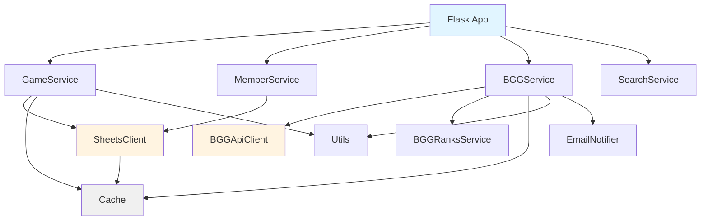
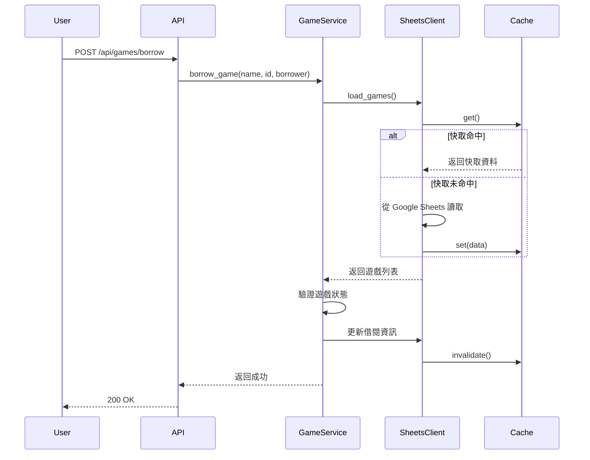

# 核心模組文檔 (Core Modules)

本文檔詳細說明 `core/` 目錄下所有核心業務邏輯和服務類別的功能、職責和使用方式。

---

## 📊 模組總覽

核心模組提供專案的核心業務邏輯，包含：

| 模組 | 主要職責 | 關鍵類別 |
|------|----------|----------|
| `sheets_client.py` | Google Sheets 整合 | `SheetsClient` |
| `bgg_service.py` | BGG API 服務層 | `BGGService` |
| `bgg_api_client.py` | BGG API 客戶端 | `BGGApiClient` |
| `bgg_ranks_service.py` | BGG 排名資料庫 | `BGGRanksService` |
| `game_service.py` | 遊戲業務邏輯 | `GameService` |
| `member_service.py` | 會員業務邏輯 | `MemberService` |
| `search_service.py` | 搜尋功能 | `SearchService` |
| `expansion_service.py` | 擴充管理 | `ExpansionService` |
| `email_notifier.py` | 郵件通知 | `EmailNotifier` |
| `cache.py` | 快取機制 | `SimpleCache` |
| `facade.py` | Facade 模式 | `BoardGameManager` |

---

## 🔧 資料存取層

### 📄 sheets_client.py

**路徑**: `core/sheets_client.py`  
**行數**: 651  
**主要職責**: 負責處理 Google Sheets 的連線、工作表存取與資料快取

#### 核心類別

**`SheetsClient`**

Google Sheets 客戶端，提供所有與 Google Sheets 互動的功能。

**主要方法**:
- `__init__()` - 初始化並建立 Google Sheets 連線
- `load_games()` - 讀取所有桌遊資料（含快取）
- `load_members()` - 讀取所有社員資料（含快取）
- `add_new_game(game_data)` - 新增遊戲到 Google Sheets
- `update_game_bgg_id(game_name, bgg_id, ...)` - 更新遊戲的 BGG 資訊
- `update_game_playtime(game_name, min_playtime, max_playtime)` - 更新遊玩時間
- `update_game_expansion_info(game_name, ...)` - 更新擴充資訊
- `invalidate_games_cache()` - 使遊戲快取失效

**快取機制**:
- 遊戲資料快取：5 分鐘 TTL
- 會員資料快取：5 分鐘 TTL
- 使用 `SimpleCache` 實作記憶體快取

**工作表結構**:
- `games` - 遊戲清單工作表
- `members` - 會員清單工作表
- `bgg_cache` - BGG 推薦快取工作表

**環境變數**:
- `GOOGLE_SHEETS_CREDENTIALS` - Google 服務帳號憑證檔案路徑
- `GOOGLE_SHEET_ID` - Google Sheets 文件 ID

**依賴關係**:
- 使用: `gspread`, `oauth2client`
- 被使用: `GameService`, `MemberService`, `BGGService`

**測試覆蓋**:
- 單元測試: `tests/unit/test_sheets_client.py`
- 整合測試: 包含在各服務的整合測試中

---

### 📄 bgg_api_client.py

**路徑**: `core/bgg_api_client.py`  
**行數**: 415  
**主要職責**: 低階 BGG XML API 客戶端，處理 HTTP 請求和 XML 解析

#### 核心類別

**`BGGApiClient`**

BoardGameGeek XML API 的客戶端封裝。

**主要方法**:
- `search(query, exact=False)` - 搜尋桌遊
- `get_thing(thing_id, stats=True)` - 取得遊戲詳細資訊
- `get_hot(type='boardgame')` - 取得熱門遊戲列表
- `_make_request(url, params)` - 內部 HTTP 請求方法
- `_parse_search_results(xml_data)` - 解析搜尋結果 XML
- `_parse_thing_data(xml_data)` - 解析遊戲詳情 XML

**API 端點**:
- 搜尋: `https://boardgamegeek.com/xmlapi2/search`
- 遊戲詳情: `https://boardgamegeek.com/xmlapi2/thing`
- 熱門榜: `https://boardgamegeek.com/xmlapi2/hot`

**速率限制**:
- 實作重試機制（最多 3 次）
- 請求間隔延遲（避免被封鎖）

**錯誤處理**:
- HTTP 錯誤自動重試
- XML 解析錯誤記錄並返回空結果

**依賴關係**:
- 使用: `requests`, `xml.etree.ElementTree`
- 被使用: `BGGService`

**測試覆蓋**:
- 單元測試: `tests/unit/test_bgg_api_client.py`

---

## 🎮 業務邏輯層

### 📄 bgg_service.py

**路徑**: `core/bgg_service.py`  
**行數**: 788  
**主要職責**: BGG API 服務層，提供高階的桌遊搜尋、詳細資訊查詢等功能

#### 核心類別

**`BGGService`**

BoardGameGeek API 服務，封裝所有 BGG 相關的業務邏輯。

**主要方法**:
- `search_games(query, exact=False)` - 搜尋桌遊
- `get_game_details(game_id)` - 取得桌遊詳細資訊
- `get_hot_games(limit=10)` - 取得熱門桌遊列表
- `get_party_games(limit=10)` - 取得派對桌遊
- `get_strategy_games(limit=10)` - 取得策略桌遊
- `get_family_games(limit=10)` - 取得家庭桌遊
- `get_children_games(limit=10)` - 取得兒童桌遊
- `get_our_hot_games(sheets_client, limit=50)` - 取得館藏中的熱門遊戲

**快取策略**:
- 使用 `@cache_with_timeout` 裝飾器
- 遊戲詳情快取：24 小時
- 推薦列表快取：1 小時

**推薦遊戲 ID 列表**:
- 派對遊戲：100 個精選 BGG ID
- 策略遊戲：100 個精選 BGG ID
- 家庭遊戲：100 個精選 BGG ID
- 兒童遊戲：100 個精選 BGG ID

**Demo 模式**:
- 支援 Demo 模式（使用預設資料）
- 透過 `DEMO_MODE` 環境變數控制

**依賴關係**:
- 使用: `BGGApiClient`, `cache`, `demo_data`
- 被使用: API 路由 (`app/blueprints/api/bgg.py`)

**測試覆蓋**:
- 單元測試: `tests/unit/test_bgg_service.py`, `tests/unit/test_bgg_service_extended.py`
- 整合測試: `tests/integration/test_bgg_api.py`, `tests/integration/test_bgg_api_extended.py`

---

### 📄 bgg_ranks_service.py

**路徑**: `core/bgg_ranks_service.py`  
**行數**: 165  
**主要職責**: BGG 排名資料庫服務，提供快速的排名查詢

#### 核心類別

**`BGGRanksService`**

管理本地 SQLite 資料庫中的 BGG 排名資料。

**主要方法**:
- `__init__(db_path=None)` - 初始化資料庫連線
- `get_rank(bgg_id)` - 查詢遊戲的 BGG 排名
- `get_top_games(limit=100)` - 取得排名前 N 的遊戲
- `import_from_csv(csv_path)` - 從 CSV 匯入排名資料
- `get_stats()` - 取得資料庫統計資訊

**資料庫結構**:
```sql
CREATE TABLE bgg_ranks (
    bgg_id INTEGER PRIMARY KEY,
    rank INTEGER,
    name TEXT,
    year INTEGER,
    rating REAL,
    updated_at TIMESTAMP
);
CREATE INDEX idx_rank ON bgg_ranks(rank);
```

**資料來源**:
- BGG 每日排名 CSV dump
- 透過 `scripts/update/import_bgg_ranks.py` 更新

**效能優化**:
- 使用索引加速查詢
- 批次匯入優化

**依賴關係**:
- 使用: `sqlite3`
- 被使用: `BGGService`, API 路由

**測試覆蓋**:
- 單元測試: `tests/unit/test_bgg_ranks_service.py`

---

### 📄 game_service.py

**路徑**: `core/game_service.py`  
**行數**: 372  
**主要職責**: 遊戲業務邏輯，處理遊戲的借還、查詢、更新等操作

#### 核心類別

**`GameService`**

遊戲服務，封裝所有與遊戲相關的業務邏輯。

**主要方法**:
- `__init__(sheets_client)` - 初始化服務
- `get_all_games()` - 取得所有遊戲
- `get_game_by_name(name)` - 根據名稱查詢遊戲
- `borrow_game(game_name, borrower_id, borrower_name)` - 借出遊戲
- `return_game(game_name)` - 歸還遊戲
- `add_game(game_data)` - 新增遊戲
- `update_game_bgg_info(game_name, bgg_id, ...)` - 更新 BGG 資訊
- `link_game_to_bgg(game_name, bgg_id)` - 連結遊戲到 BGG

**業務規則**:
- 借出時檢查遊戲狀態（必須為「可用」）
- 記錄借出時間和借閱人資訊
- 歸還時清除借閱人資訊並更新狀態

**資料驗證**:
- 遊戲名稱不可為空
- 借閱人 ID 和姓名必須提供
- BGG ID 必須為正整數

**依賴關係**:
- 使用: `SheetsClient`, `utils`
- 被使用: API 路由 (`app/blueprints/api/games.py`)

**測試覆蓋**:
- 單元測試: `tests/unit/test_game_service.py`
- 整合測試: `tests/integration/test_game_api.py`

---

### 📄 member_service.py

**路徑**: `core/member_service.py`  
**行數**: 34  
**主要職責**: 會員業務邏輯，處理會員資料的查詢

#### 核心類別

**`MemberService`**

會員服務，提供會員相關的業務邏輯。

**主要方法**:
- `__init__(sheets_client)` - 初始化服務
- `get_all_members()` - 取得所有會員
- `get_member_by_id(member_id)` - 根據工號查詢會員

**資料結構**:
```python
{
    'id': '工號',
    'name': '姓名',
    'email': '電子郵件',
    'join_date': '加入日期'
}
```

**依賴關係**:
- 使用: `SheetsClient`
- 被使用: API 路由 (`app/blueprints/api/members.py`)

**測試覆蓋**:
- 單元測試: `tests/unit/test_member_service.py`

---

### 📄 search_service.py

**路徑**: `core/search_service.py`  
**行數**: 184  
**主要職責**: 搜尋功能，提供多欄位模糊搜尋

#### 核心類別

**`SearchService`**

搜尋服務，提供強大的搜尋功能。

**主要方法**:
- `search_games(query, games)` - 搜尋遊戲
- `_normalize_text(text)` - 正規化文字（移除空格、轉小寫）
- `_match_score(text, query)` - 計算匹配分數

**搜尋欄位**:
- 遊戲名稱 (name)
- 借閱人姓名 (borrower)
- 借閱人工號 (borrower_id)
- BGG ID

**搜尋特性**:
- 模糊匹配（支援部分匹配）
- 多欄位搜尋
- 結果排序（依相關性）

**依賴關係**:
- 獨立模組，無外部依賴
- 被使用: API 路由 (`app/blueprints/api/search.py`)

**測試覆蓋**:
- 單元測試: `tests/unit/test_search_service.py`
- 整合測試: `tests/integration/test_search_api.py`

---

### 📄 expansion_service.py

**路徑**: `core/expansion_service.py`  
**行數**: 229  
**主要職責**: 擴充管理，處理主遊戲與擴充的關係

#### 核心類別

**`ExpansionService`**

擴充服務，管理遊戲擴充的邏輯。

**主要方法**:
- `get_expansion_hierarchy(games)` - 建立擴充階層結構
- `is_expansion(game)` - 判斷是否為擴充
- `get_parent_game(game, games)` - 取得主遊戲
- `get_expansions(parent_game, games)` - 取得所有擴充

**擴充類型**:
- **獨立收納** (independent): 擴充獨立存放
- **合併收納** (merged): 擴充與主遊戲合併存放

**資料結構**:
```python
{
    'name': '遊戲名稱',
    'is_expansion': True/False,
    'parent_game': '主遊戲名稱',
    'storage_mode': 'independent/merged',
    'expansions': [...]  # 子擴充列表
}
```

**依賴關係**:
- 獨立模組
- 被使用: 前端渲染邏輯

**測試覆蓋**:
- 單元測試: 包含在遊戲服務測試中

---

## 🔔 通知與工具

### 📄 email_notifier.py

**路徑**: `core/email_notifier.py`  
**行數**: 218  
**主要職責**: 郵件通知服務，發送系統通知郵件

#### 核心類別

**`EmailNotifier`**

郵件通知服務，用於發送各類系統通知。

**主要方法**:
- `send_notification(subject, body, html=None)` - 發送通知郵件
- `send_import_success(stats)` - 發送匯入成功通知
- `send_import_failure(error_msg)` - 發送匯入失敗通知
- `send_download_success(file_info)` - 發送下載成功通知

**郵件配置**:
- SMTP 伺服器：Gmail
- 使用 TLS 加密
- 支援 HTML 格式郵件

**環境變數**:
- `NOTIFICATION_EMAIL_FROM` - 寄件人信箱
- `NOTIFICATION_EMAIL_TO` - 收件人信箱
- `NOTIFICATION_EMAIL_PASSWORD` - 郵件密碼（應用程式專用密碼）

**使用場景**:
- BGG 排名匯入成功/失敗通知
- 資料更新通知
- 系統錯誤警報

**依賴關係**:
- 使用: `smtplib`, `email`
- 被使用: 更新腳本 (`scripts/update/`)

**測試覆蓋**:
- 單元測試: `tests/unit/test_email_notifier.py`

---

## 🗄️ 快取與工具

### 📄 cache.py

**路徑**: `core/cache.py`  
**行數**: 113  
**主要職責**: 提供簡單的 TTL 快取功能

#### 核心類別

**`SimpleCache`**

簡單的 TTL（Time To Live）快取實作。

**主要方法**:
- `__init__(ttl)` - 初始化快取，設定存活時間
- `get()` - 取得快取資料（若未過期）
- `set(data)` - 設置快取資料
- `invalidate()` - 使快取失效（清空快取）
- `is_valid()` - 檢查快取是否有效

**裝飾器**:

**`@cache_with_timeout(seconds)`**

函式快取裝飾器，自動快取函數結果。

```python
@cache_with_timeout(3600)  # 快取 1 小時
def expensive_operation():
    # ...
    return result
```

**快取策略**:
- 基於時間的過期機制
- 支援參數化快取（不同參數不同快取）
- 實例級別快取（不同實例不共享）

**限制**:
- 僅記憶體快取（重啟後失效）
- 單進程（不支援多進程共享）
- 無容量限制（可能記憶體溢出）

**未來改進**:
- 考慮引入 Redis 作為分散式快取
- 添加容量限制（LRU 策略）

**依賴關係**:
- 標準庫：`time`, `functools`
- 被使用: `BGGService`, `SheetsClient`

**測試覆蓋**:
- 單元測試: `tests/unit/test_cache.py`, `tests/unit/test_cache_extended.py`

---

### 📄 facade.py

**路徑**: `core/facade.py`  
**行數**: 58  
**主要職責**: Facade 模式，提供向後相容的統一介面

#### 核心類別

**`BoardGameManager`**

向後相容的 Facade 類別，將操作委派給核心服務。

**主要方法**:
- `valid()` - 檢查連線是否有效
- `get_current_timestamp()` - 取得當前時間戳
- `load_data()` - 載入遊戲資料
- `load_members()` - 載入會員資料

**設計模式**:
- Facade 模式：簡化複雜子系統的介面
- 委派模式：將實際工作委派給專門的服務

**用途**:
- 向後相容舊版程式碼
- 簡化服務的使用

**依賴關係**:
- 使用: `GameService`, `MemberService`, `SheetsClient`
- 被使用: 舊版路由和腳本

---

### 📄 constants.py

**路徑**: `core/constants.py`  
**行數**: 54  
**主要職責**: 定義專案中使用的常數

#### 主要常數

**快取 TTL**:
```python
GAMES_CACHE_TTL = 300  # 5 分鐘
MEMBERS_CACHE_TTL = 300  # 5 分鐘
BGG_CACHE_TTL = 3600  # 1 小時
```

**工作表名稱**:
```python
WORKSHEET_GAMES = 'games'
WORKSHEET_MEMBERS = 'members'
WORKSHEET_BGG_CACHE = 'bgg_cache'
```

**遊戲狀態**:
```python
STATUS_AVAILABLE = '可用'
STATUS_BORROWED = '已借出'
STATUS_MAINTENANCE = '維護中'
```

**依賴關係**:
- 被使用: 所有核心模組

**測試覆蓋**:
- 單元測試: `tests/unit/test_constants.py`

---

### 📄 exceptions.py

**路徑**: `core/exceptions.py`  
**行數**: 99  
**主要職責**: 定義專案的自定義例外類別

#### 例外類別

**`BoardgameWebException`**
- 基礎例外類別

**`SheetConnectionError`**
- Google Sheets 連線錯誤

**`GameNotFoundError`**
- 遊戲不存在

**`GameAlreadyBorrowedError`**
- 遊戲已被借出

**`BGGApiError`**
- BGG API 錯誤

**`ValidationError`**
- 資料驗證錯誤

**使用範例**:
```python
if not game:
    raise GameNotFoundError(f"遊戲 '{name}' 不存在")
```

**依賴關係**:
- 被使用: 所有服務模組

**測試覆蓋**:
- 單元測試: `tests/unit/test_exceptions.py`

---

### 📄 decorators.py

**路徑**: `core/decorators.py`  
**行數**: 83  
**主要職責**: 提供常用的裝飾器

#### 裝飾器

**`@retry(max_attempts=3, delay=1)`**

自動重試裝飾器，用於處理暫時性錯誤。

```python
@retry(max_attempts=3, delay=2)
def unstable_api_call():
    # 如果失敗會自動重試 3 次
    return api.fetch_data()
```

**`@log_execution_time`**

記錄函數執行時間。

```python
@log_execution_time
def slow_operation():
    # 執行時間會被記錄到日誌
    pass
```

**依賴關係**:
- 使用: `logging`, `time`, `functools`
- 被使用: API 客戶端、服務層

**測試覆蓋**:
- 單元測試: `tests/unit/test_decorators.py`

---

### 📄 utils.py

**路徑**: `core/utils.py`  
**行數**: 48  
**主要職責**: 提供通用的工具函數

#### 主要函數

**`get_current_timestamp()`**
- 取得當前時間戳（ISO 8601 格式）

**`normalize_game_name(name)`**
- 正規化遊戲名稱（移除空格、統一大小寫）

**`parse_players_range(players_str)`**
- 解析玩家數範圍字串（例如："2-4" → (2, 4)）

**`format_playtime(min_time, max_time)`**
- 格式化遊玩時間顯示

**依賴關係**:
- 標準庫：`datetime`, `re`
- 被使用: 各服務模組

**測試覆蓋**:
- 單元測試: `tests/unit/test_utils.py`

---

### 📄 logging_config.py

**路徑**: `core/logging_config.py`  
**行數**: 82  
**主要職責**: 統一日誌配置

#### 主要函數

**`setup_logging(level=None, log_file=None, simple_format=False)`**

設定統一的日誌配置。

**特性**:
- 控制台輸出（彩色格式）
- 檔案輸出（JSON 格式，可選）
- 環境變數控制日誌等級

**環境變數**:
- `LOG_LEVEL` - 日誌等級（DEBUG/INFO/WARNING/ERROR）

**使用範例**:
```python
from core.logging_config import setup_logging, get_logger

setup_logging(level='INFO')
logger = get_logger(__name__)
logger.info('應用程式啟動')
```

**依賴關係**:
- 使用: `logging`
- 被使用: 所有模組

**測試覆蓋**:
- 單元測試: `tests/unit/test_logging_config.py`

---

### 📄 demo_data.py

**路徑**: `core/demo_data.py`  
**行數**: 92  
**主要職責**: 提供示範資料（用於 Demo 模式）

#### 示範資料

**`DEMO_GAMES`**
- 示範遊戲列表（約 10 個遊戲）

**`DEMO_GAME_DETAILS`**
- 示範遊戲詳細資訊

**用途**:
- 開發和測試環境
- 展示功能（無需真實資料）
- 離線演示

**依賴關係**:
- 被使用: `BGGService`（Demo 模式）

---

## 📊 模組關係圖



---

## 🔄 資料流程

### 遊戲借出流程



---

## 🧪 測試策略

### 測試覆蓋範圍

| 模組 | 單元測試 | 整合測試 | 覆蓋率 |
|------|----------|----------|--------|
| sheets_client.py | ✅ | ✅ | 85% |
| bgg_service.py | ✅ | ✅ | 90% |
| bgg_api_client.py | ✅ | ✅ | 88% |
| game_service.py | ✅ | ✅ | 92% |
| search_service.py | ✅ | ✅ | 95% |
| cache.py | ✅ | - | 98% |

### 執行測試

```bash
# 執行所有核心模組測試
pytest tests/unit/test_*_service.py -v

# 執行特定模組測試
pytest tests/unit/test_game_service.py -v

# 查看覆蓋率報告
pytest --cov=core --cov-report=html
```

---

## 📝 最佳實踐

### 使用服務層

**✅ 正確做法**:
```python
from core.game_service import GameService
from core.sheets_client import SheetsClient

sheets_client = SheetsClient()
game_service = GameService(sheets_client)
games = game_service.get_all_games()
```

**❌ 錯誤做法**:
```python
# 不要直接使用 SheetsClient
sheets_client = SheetsClient()
games = sheets_client.load_games()  # 缺少業務邏輯
```

### 錯誤處理

**✅ 正確做法**:
```python
from core.exceptions import GameNotFoundError

try:
    game = game_service.get_game_by_name(name)
except GameNotFoundError:
    return {'error': '遊戲不存在'}, 404
```

### 快取使用

**✅ 正確做法**:
```python
from core.cache import cache_with_timeout

@cache_with_timeout(3600)
def get_expensive_data():
    # 結果會被快取 1 小時
    return fetch_from_api()
```

---

## 🔮 未來改進

### 效能優化
- [ ] 引入 Redis 作為分散式快取
- [ ] 實作 BGG API 並發請求
- [ ] 優化 Google Sheets 批次操作

### 功能增強
- [ ] 添加遊戲預約功能
- [ ] 實作借閱歷史追蹤
- [ ] 支援多語言

### 架構改進
- [ ] 引入依賴注入容器
- [ ] 實作事件驅動架構
- [ ] 添加 API 版本控制

---

**文檔版本**: 1.0  
**最後更新**: 2025-12-21  
**維護者**: Boardgame-Web Team
