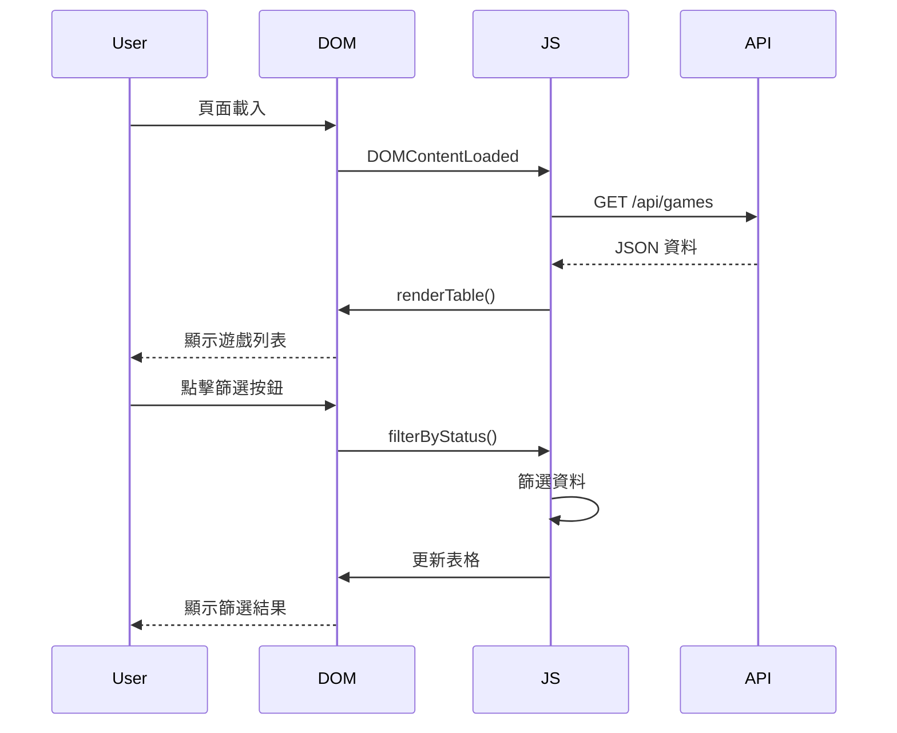

# 前端資源文檔 (Frontend Resources)

本文檔詳細說明 `static/` 目錄下的前端資源，包含 JavaScript、CSS 和 HTML 模板的功能和設計。

---

## 📊 前端架構總覽

```
static/
├── js/                  # JavaScript 檔案
│   ├── script.js       # 主要邏輯（872 行）
│   ├── admin.js        # 管理頁面
│   ├── gallery.js      # 圖庫功能
│   ├── bgg.js          # BGG 整合
│   ├── search.js       # 搜尋功能
│   ├── lazy-load.js    # 懶載入
│   ├── loading.js      # 載入動畫
│   ├── gestures.js     # 手勢控制
│   └── theme-switcher.js # 主題切換
├── css/                 # 樣式表
│   ├── style.css       # 主要樣式（745 行）
│   ├── mobile.css      # 響應式設計
│   ├── themes.css      # 主題樣式
│   ├── gallery.css     # 圖庫樣式
│   └── ...
└── html/                # HTML 模板
    ├── index.html      # 首頁
    ├── admin.html      # 管理頁面
    ├── gallery.html    # 圖庫頁面
    └── gallery_demo.html # 圖庫示範
```

---

## 💻 JavaScript 模組

### 📄 script.js

**路徑**: `static/js/script.js`  
**行數**: 872  
**主要職責**: 首頁的核心前端邏輯

#### 全域變數

```javascript
const apiBase = '/api';
let allGames = [];              // 所有遊戲資料
let allMembers = [];            // 所有會員資料
let memberNameToId = {};        // 姓名到工號的映射
let currentStatusFilter = 'all'; // 當前狀態篩選
let currentPlayerFilters = new Set(); // 人數篩選條件
```

#### 核心功能

**1. 資料載入**

**`loadGames()`**
- 從 API 載入遊戲資料
- 更新統計資訊
- 渲染表格
- 更新最後更新時間

```javascript
async function loadGames() {
    const response = await fetch(`${apiBase}/games`);
    const data = await response.json();
    allGames = data.games;
    updateStats();
    renderTable(allGames);
}
```

**2. 表格渲染**

**`renderTable(games)`**
- 支援階層式顯示（主遊戲 + 擴充）
- 動態生成表格行
- 處理遊戲縮圖
- 狀態標示

**關鍵特性**:
- 擴充遊戲縮排顯示
- 可折疊/展開擴充列表
- 縮圖懸停放大
- 狀態徽章（可用/借出）

**3. 搜尋功能**

**`debounce(func, wait)`**
- 防抖函數，減少搜尋頻率
- 延遲 50ms 執行

**搜尋歷史**:
- `getSearchHistory()` - 取得搜尋歷史
- `saveSearchToHistory(query)` - 儲存搜尋記錄
- `showSearchHistory()` - 顯示歷史下拉選單
- 最多儲存 10 筆歷史記錄

**4. 篩選功能**

**`filterByStatus(status)`**
- 按狀態篩選（全部/借出/可用）

**`filterByPlayers(players)`**
- 按玩家人數篩選
- 支援多選（使用 Set）
- 範圍匹配（例如：2-4 人遊戲匹配 3 人篩選）

**`matchesPlayerCount(gamePlayers, filterPlayers)`**
- 智能匹配玩家數範圍

**5. 借還功能**

**`executeSingleBorrow(gameName)`**
- 單筆借出
- 包含會員驗證
- 自動完成借閱人輸入

**`executeSingleReturn(gameName)`**
- 單筆歸還
- 更新遊戲狀態

**6. 管理功能（Admin 頁面）**

- 批次借出（最多 5 筆）
- 批次歸還
- 全選功能（限制 5 筆）
- Checkbox 狀態管理

#### 事件處理

```javascript
document.addEventListener('DOMContentLoaded', () => {
    loadGames();
    
    // 篩選按鈕
    document.querySelectorAll('.filter-btn').forEach(btn => {
        btn.addEventListener('click', () => filterByStatus(btn.dataset.filter));
    });
    
    // 人數篩選
    document.querySelectorAll('.player-btn').forEach(btn => {
        btn.addEventListener('click', () => filterByPlayers(btn.dataset.players));
    });
    
    // 搜尋功能
    searchBox.addEventListener('input', debounce((e) => {
        // 搜尋邏輯
    }, 50));
});
```

---

### 📄 admin.js

**路徑**: `static/js/admin.js`  
**主要職責**: 管理頁面專用功能

**功能**:
- 批次操作介面
- 遊戲編輯 Modal
- BGG 連結功能
- 快取刷新

---

### 📄 gallery.js

**路徑**: `static/js/gallery.js`  
**主要職責**: 圖庫牆功能

**功能**:
- 網格布局渲染
- 圖片懶載入
- 分類篩選
- 排序功能（名稱/評分/排名）

---

### 📄 bgg.js

**路徑**: `static/js/bgg.js`  
**主要職責**: BGG 整合功能

**功能**:
- BGG 遊戲搜尋
- 推薦列表載入
- 分類切換（派對/策略/家庭/兒童）
- 遊戲詳情顯示

---

### 📄 search.js

**路徑**: `static/js/search.js`  
**主要職責**: 進階搜尋功能

**功能**:
- 多欄位搜尋
- 模糊匹配
- 搜尋建議

---

### 📄 lazy-load.js

**路徑**: `static/js/lazy-load.js`  
**主要職責**: 圖片懶載入

**實作方式**:
- 使用 Intersection Observer API
- 佔位圖片
- 載入動畫

```javascript
const observer = new IntersectionObserver((entries) => {
    entries.forEach(entry => {
        if (entry.isIntersecting) {
            const img = entry.target;
            img.src = img.dataset.src;
            observer.unobserve(img);
        }
    });
});
```

---

### 📄 loading.js

**路徑**: `static/js/loading.js`  
**主要職責**: 載入動畫

**功能**:
- 顯示/隱藏載入指示器
- 全頁面覆蓋
- 旋轉動畫

---

### 📄 gestures.js

**路徑**: `static/js/gestures.js`  
**主要職責**: 觸控手勢支援

**功能**:
- 滑動手勢
- 雙擊縮放
- 觸控友好

---

### 📄 theme-switcher.js

**路徑**: `static/js/theme-switcher.js`  
**主要職責**: 主題切換

**功能**:
- 亮色/暗色主題切換
- LocalStorage 儲存偏好
- 平滑過渡動畫

---

## 🎨 CSS 樣式系統

### 📄 style.css

**路徑**: `static/css/style.css`  
**行數**: 745  
**主要職責**: 主要樣式表

#### 設計系統

**顏色變數**:
```css
/* 主色調 */
--primary: #667eea;
--primary-hover: #5568d3;

/* 狀態顏色 */
--success: #48bb78;
--error: #f56565;
--warning: #ed8936;

/* 中性色 */
--gray-50: #f7fafc;
--gray-100: #edf2f7;
--gray-200: #e2e8f0;
--gray-700: #2d3748;
```

**字體系統**:
```css
body {
    font-family: -apple-system, BlinkMacSystemFont, 
                 'Segoe UI', 'Microsoft JhengHei', sans-serif;
}
```

**間距系統**:
- 基礎單位: 4px
- 常用間距: 8px, 12px, 16px, 20px, 24px

#### 核心組件樣式

**1. 統計卡片**

```css
.stat-card {
    background: white;
    padding: 12px 18px;
    border-radius: 12px;
    box-shadow: 0 2px 8px rgba(0, 0, 0, 0.08);
    transition: transform 0.2s ease;
}

.stat-card:hover {
    transform: translateY(-3px);
}
```

**2. 搜尋框**

```css
.search {
    width: 100%;
    padding: 12px 20px;
    border: 2px solid #e2e8f0;
    border-radius: 8px;
    transition: all 0.2s ease;
}

.search:focus {
    border-color: #667eea;
    box-shadow: 0 0 0 3px rgba(102, 126, 234, 0.1);
}
```

**3. 篩選按鈕**

```css
.filter-btn {
    padding: 10px 20px;
    border: 2px solid #e2e8f0;
    background: white;
    border-radius: 8px;
    transition: all 0.2s ease;
}

.filter-btn.active {
    background: #667eea;
    color: white;
}
```

**4. 表格樣式**

```css
table {
    width: 100%;
    background: white;
    border-radius: 12px;
    box-shadow: 0 2px 8px rgba(0, 0, 0, 0.08);
}

th {
    background: #667eea;
    color: white;
    padding: 16px 12px;
    position: sticky;
    top: 0;
}

tbody tr:hover {
    background: #f7fafc;
}
```

**5. 狀態徽章**

```css
.status-badge {
    display: inline-flex;
    align-items: center;
    gap: 6px;
    padding: 4px 12px;
    border-radius: 12px;
    font-weight: 600;
}

.status-available {
    color: #38a169;
    background: #f0fff4;
}

.status-borrowed {
    color: #e53e3e;
    background: #fff5f5;
}
```

**6. Toast 通知**

```css
.toast {
    position: fixed;
    top: 30px;
    right: 30px;
    background: #2d3748;
    color: white;
    padding: 18px 24px;
    border-radius: 8px;
    opacity: 0;
    transform: translateX(400px);
    transition: all 0.3s ease;
}

.toast.show {
    opacity: 1;
    transform: translateX(0);
}
```

#### 響應式設計

**平板 (≤768px)**:
```css
@media (max-width: 768px) {
    h1 {
        font-size: 2em;
    }
    
    .stats-container {
        flex-wrap: wrap;
    }
    
    table {
        font-size: 13px;
    }
}
```

**手機 (≤480px)**:
```css
@media (max-width: 480px) {
    h1 {
        font-size: 1.75em;
    }
    
    .stats-container {
        flex-direction: column;
    }
}
```

---

### 📄 themes.css

**路徑**: `static/css/themes.css`  
**主要職責**: 主題樣式

**暗色主題**:
```css
[data-theme="dark"] {
    --bg-primary: #1a202c;
    --bg-secondary: #2d3748;
    --text-primary: #f7fafc;
    --text-secondary: #cbd5e0;
}
```

---

### 📄 mobile.css

**路徑**: `static/css/mobile.css`  
**主要職責**: 移動裝置優化

**特性**:
- 觸控友好的按鈕大小
- 簡化的導航
- 優化的表格顯示

---

## 📱 HTML 模板

### 📄 index.html

**路徑**: `static/html/index.html`  
**行數**: 158  
**主要職責**: 首頁模板

#### 頁面結構

```html
<!DOCTYPE html>
<html lang="zh-Hant">
<head>
    <!-- Meta 標籤 -->
    <meta charset="UTF-8">
    <meta name="viewport" content="width=device-width, initial-scale=1.0">
    <title>瑞昱桌遊社 - Web 版管理系統</title>
    
    <!-- CSS 樣式表 -->
    <link rel="stylesheet" href="/css/style.css">
    <link rel="stylesheet" href="/css/themes.css">
    <!-- ... 其他樣式表 -->
</head>
<body>
    <!-- 標題和統計資訊 -->
    <div class="header-stats-wrapper">
        <h1>瑞昱桌遊社 - 桌遊管理系統</h1>
        <div class="stats-container">
            <!-- 統計卡片 -->
        </div>
    </div>
    
    <!-- 搜尋和篩選 -->
    <div class="search-filter-container">
        <!-- 搜尋框 -->
        <!-- 篩選按鈕 -->
    </div>
    
    <!-- BGG 功能區 -->
    <div class="bgg-section">
        <!-- BGG 搜尋和推薦 -->
    </div>
    
    <!-- 遊戲表格 -->
    <table id="gameTable">
        <thead><!-- 表頭 --></thead>
        <tbody><!-- 資料行 --></tbody>
    </table>
    
    <!-- Toast 通知 -->
    <div id="toast" class="toast"></div>
    
    <!-- JavaScript -->
    <script src="/js/script.js"></script>
    <script src="/js/bgg.js"></script>
    <!-- ... 其他腳本 -->
</body>
</html>
```

#### 關鍵元素

**統計卡片**:
```html
<div class="stat-card">
    <div class="stat-value" id="totalCount">0</div>
    <div class="stat-label">總數</div>
</div>
```

**搜尋框**:
```html
<input type="text" id="searchBox" class="search" 
       placeholder="🔍 搜尋桌遊名稱、借閱人、工號...">
```

**篩選按鈕**:
```html
<button class="filter-btn active" data-filter="all">全部</button>
<button class="player-btn" data-players="2">2人</button>
```

---

### 📄 admin.html

**路徑**: `static/html/admin.html`  
**主要職責**: 管理頁面

**特殊功能**:
- Checkbox 選擇（限制 5 筆）
- 批次操作按鈕
- 遊戲編輯 Modal
- BGG 連結介面

---

### 📄 gallery.html

**路徑**: `static/html/gallery.html`  
**主要職責**: 圖庫牆

**布局**:
- CSS Grid 網格布局
- 響應式列數（1-4 列）
- 卡片式設計

---

## 🔄 前端資料流程



---

## 🎯 效能優化

### 已實作

1. **防抖搜尋** - 減少 API 呼叫
2. **懶載入圖片** - 減少初始載入時間
3. **CSS 過渡動畫** - 硬體加速
4. **Sticky 表頭** - 改善滾動體驗

### 待優化

1. **虛擬滾動** - 大量資料渲染
2. **程式碼分割** - 減少初始 bundle 大小
3. **Service Worker** - 離線支援
4. **圖片壓縮** - 減少檔案大小

---

## 📝 最佳實踐

### JavaScript

**✅ 正確做法**:
```javascript
// 使用 async/await
async function loadGames() {
    try {
        const response = await fetch(`${apiBase}/games`);
        const data = await response.json();
        renderTable(data.games);
    } catch (error) {
        showToast('載入失敗', 'error');
    }
}

// 使用防抖
searchBox.addEventListener('input', debounce((e) => {
    performSearch(e.target.value);
}, 300));
```

**❌ 錯誤做法**:
```javascript
// 不使用錯誤處理
function loadGames() {
    fetch(`${apiBase}/games`)
        .then(r => r.json())
        .then(data => renderTable(data.games));
}

// 沒有防抖
searchBox.addEventListener('input', (e) => {
    performSearch(e.target.value); // 每次輸入都觸發
});
```

### CSS

**✅ 正確做法**:
```css
/* 使用 CSS 變數 */
.btn {
    background: var(--primary);
    transition: all 0.2s ease;
}

/* 響應式設計 */
@media (max-width: 768px) {
    .container {
        padding: 15px;
    }
}
```

---

## 🔮 未來改進

### 功能增強
- [ ] 添加鍵盤快捷鍵
- [ ] 實作拖放排序
- [ ] 添加圖表視覺化
- [ ] PWA 支援

### 效能優化
- [ ] 實作虛擬滾動
- [ ] 使用 Web Workers
- [ ] 圖片 WebP 格式
- [ ] CSS/JS 壓縮和合併

### 使用者體驗
- [ ] 添加載入骨架屏
- [ ] 改善錯誤訊息
- [ ] 添加操作提示
- [ ] 無障礙改進

---

**文檔版本**: 1.0  
**最後更新**: 2025-12-21  
**維護者**: Boardgame-Web Team
